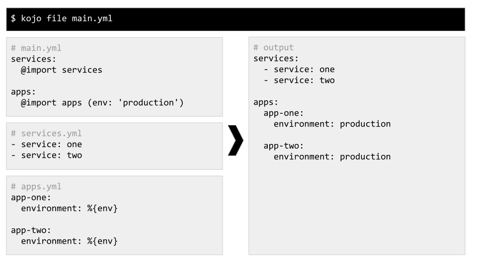

<div align='center'>


# Kojo Configuration Ninja

[](https://badge.fury.io/rb/kojo)
[](https://github.com/DannyBen/kojo/actions?query=workflow%3ATest)
[](https://codeclimate.com/github/DannyBen/kojo/maintainability)


Kojo helps you generate configuration files from templates, using variables 
and definition files. It is a command line utility, and works on any text file
format.

</div>

---

## Table of Contents

- [Installation](#installation)
- [Usage](#usage)
  - [Variables](#variables)
  - [Import](#import)
  - [Transform an Entire Folder](#transform-an-entire-folder)
  - [Transform One to Many using Config](#transform-one-to-many-using-config)
  - [Transform One to Many using Front Matter](#transform-one-to-many-using-front-matter)
  - [Interactive Form Templates](#interactive-form-templates)
  - [Conditions and Loops with ERB](#conditions-and-loops-with-erb)
- [Interactive Fallback](#interactive-fallback)
- [Using from Ruby Code](#using-from-ruby-code)
- [Contributing / Support](#contributing--support)

---

## Installation

```shell
$ gem install kojo
```

Or with Docker:

```shell
$ alias kojo='docker run --rm -it -v "$PWD:/app" dannyben/kojo'
```

## Usage

If you prefer to learn by example, see the [examples](examples#examples) folder for 
several use cases. Each example subfolder contains the command to run, the 
relevant files, and the expected output.

### Variables


Include variables in your configuration templates by using this syntax: 
`%{varname}`

- Variables can be provided through the command line, or when using `@import`.
- When one or more variables are not provided, you [will be prompted to provide
  a value](#interactive-mode).
- Variables from the top level will be forwarded downstream, and aggregated 
  with any additional variables that are defined in subsequent `@imports`.

### Import



Use the `@import filename` directive anywhere to include another file in the
resulting configuration file.

- The `@import` directive should be the only thing in the line.
- The indentation will be respected when importing.
- The `filename` parameter does not have to include an extension - Kojo will
  use the same extension as the parent file.
- The included file will be searched for relative to the file it is included 
  in.
- Arguments can be passed down to the included template by using this syntax:

```ruby
@import filename (arg: "value", arg2: "value")
```

The space after `filename` is optional.

### Transform an Entire Folder


Process a folder containing templates and `@imports`, and generate a mirror
output folder, with all the variables and `@imports` evaluated.

You may use `%{variables}` in filenames.

### Transform One to Many using Config


Using the `kojo config` command together with a simple definitions file, you
can:

1. Generate multiple output files based on a single template file
2. Generate multiple output directories, based on a single source directory.

To achieve this, you need to:

1. Create the configuration template or directory of templates.
2. Create a configuration YAML file using this syntax:

```yaml
input: base-template.yml

output:
  outfile1.yml:
    argument1: value
    argument2: value

  outfile2.yml:
    argument1: value
    argument2: value
```

When using a folder as input, simply provide the folder name in the `input` 
property, and instead of providing desired output filenames in the `output`
property, provide desired output directories:

```yaml
input: base

output:
  app1:
    argument1: value
    argument2: value

  app2:
    argument1: value
    argument2: value
```

### Transform One to Many using Front Matter


Define a template that contains the instructions on how to transform it as a
YAML front matter.

The YAML front matter should be structured like this:

```yaml
filename2:
  arg: value
  another_arg: value

filename2:
  arg: value
  another_arg: value
---
Your template that uses %{arg} goes here
...
```

Additional arguments provided to the command line, will also be transferred
to the template.

### Interactive Form Templates


Using the `kojo form` command lets you define an ERB or [ERBX][erbx] template, and include interactive prompts to enter the input. 

1. Use either ERB tags (`<%= %>`, `<%- -%>`) or ERBX tags (`{{ }}`, `(( ))`).
2. Use the built in `prompt` object, which is a [TTY::Prompt](tty-prompt) instance, to prompt for input when running the command (for example: `{{ prompt.ask? "Your Name?" }}`)
3. Any unidentified ruby command will be forwarded to the `prompt` object, so `prompt.ask` is the same as just using `ask`.
4. If there is a file with the same name as the template, and with an `.rb` extension (for example `form.md` and `form.md.rb`), then the ruby file will be loaded into the ERB template as if it was written inside it.
5. If you prefer using a single template file (without the ruby appendix), you can simply use regular ERB/ERBX tags, like demonstrated below.


### Conditions and Loops with ERB


Template files are evaluated using ERB, so you can use any Ruby code for more
advanced templates (for conditions, loops etc.).

Use this syntax for ruby code:

```erb
<%- ruby code here -%>     # for code that should not be printed
<%= ruby code here -%>     # for code that should be printed
```
## Interactive Fallback

When Kojo encounters a variable that was not supplied (either through the command 
line or through a configuration file), it will prompt for a value.


You can enable or disable interactive mode by setting the environment
variable `KOJO_INTERACTIVE` to `yes` or `no`.

By default, interactivity is enabled when running the CLI, and disabled when
running from within Ruby code.

When running from within Ruby code, you can also use `Kojo.interactive = true`
and `Kojo.interactive?` to get the current state.

## Using from Ruby Code

Although Kojo was primarily designed as a command line utility, you can also
use it as a library from your Ruby code.

These are the primary classes:

| Class                       | Description                                  | CLI equivalent |
| --------------------------- | -------------------------------------------- | -------------- |
| `Kojo::Template`            | generate from a single template              | `kojo file`    |
| `Kojo::FrontMatterTemplate` | generate from a template with a front matter | `kojo single`  |
| `Kojo::Config`              | generate from a config file                  | `kojo config`  |
| `Kojo::Collection`          | generate from a directory                    | `kojo dir`     |
| `Kojo::Form`                | generate interactively                       | `kojo form`    |

### Examples

```ruby
# Template
template = Kojo::Template.new 'examples/variables/main.yml'
result = template.render domain: 'example.com', scale: 2
puts result

# Collection
collection = Kojo::Collection.new 'examples/dir'
collection.import_base = 'examples/dir/imports'

params = { env: 'env', app: 'app' }
result = collection.render params do |path, content|
  # code to handle results here
end

# Config
config = Kojo::Config.new 'examples/config-from-file/config.yml'
config.import_base = "examples/config-from-file/imports"

config.generate do |path, content|
  # code to handle results here
end

# FrontMatterTemplate
template = Kojo::FrontMatterTemplate.new 'examples/single/Dockerfile'
params = { version: '0.1.1' }

template.render params do |path, content|
  # code to handle results here
end

# Form
template = Kojo::Form.new 'examples/form/movie.md'
puts template.render
```

In addition, Kojo extends Ruby's `File` class with the `File.deep_write`
method, which lets you write the file and create the directory structure as
needed. You may use it in your code like this:

```ruby
# Config
config = Kojo::Config.new 'examples/config-from-file/config.yml'
config.import_base = "examples/config-from-file/imports"

config.generate do |path, content|
  File.deep_write path, content
end
```

## Contributing / Support

If you experience any issue, have a question or a suggestion, or if you wish
to contribute, feel free to [open an issue][issues].

---

[issues]: https://github.com/DannyBen/kojo/issues
[erbx]: https://github.com/DannyBen/erbx
[tty-prompt]: https://github.com/piotrmurach/tty-prompt#contents