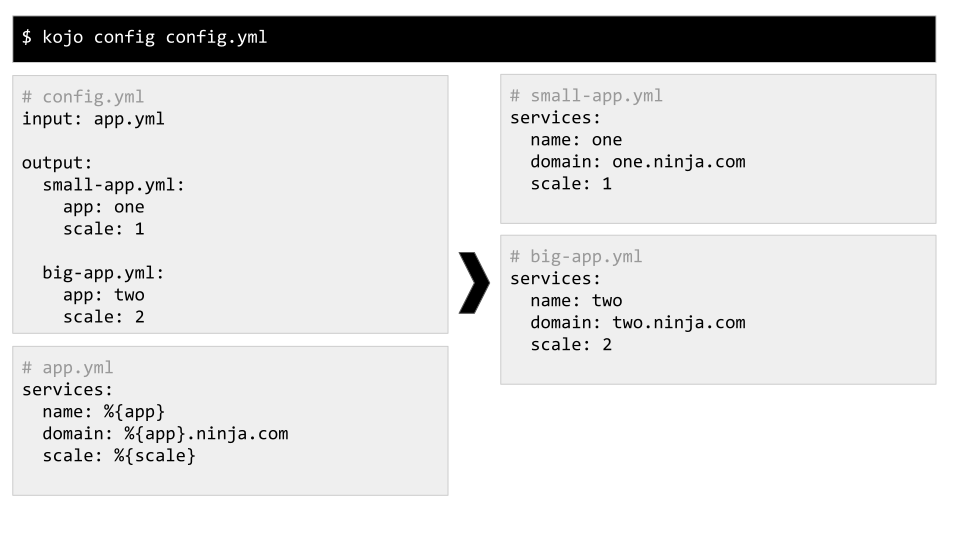

<div align='center'>


Kojo Configuration Ninja
==================================================

[](https://badge.fury.io/rb/kojo)
[](https://travis-ci.com/DannyBen/kojo)
[](https://codeclimate.com/github/DannyBen/kojo/maintainability)
[](https://codeclimate.com/github/DannyBen/kojo/test_coverage)

Kojo helps you generate configuration files from templates, using variables 
and definition files.  
It is a command line utility, and it works on any text file format.

</div>

---

Table of Contents
--------------------------------------------------

- [Installation](#installation)
- [Usage](#usage)
  - [Variables](#variables)
  - [Import](#import)
  - [Compile an Entire Folder](#compile-an-entire-folder)
  - [One to Many Generation](#one-to-many-generation)
  - [Conditions and Loops with ERB](#conditions-and-loops-with-erb)

---

Installation
--------------------------------------------------

    $ gem install kojo


Usage
--------------------------------------------------

If you prefer to learn by example, see the [examples](examples#examples) folder for 
several use cases. Each example subfolder contains the command to run, the 
relevant files, and the expected output.


### Variables


Include variables in your configuration templates by using this syntax: 
`%{varname}`

- Variables can be provided through the command line, or when using `@import`.
- When one or more variables are not provided, you will be prompted to provide
  a value.
- Variables from the top level will be forwarded downstream, and aggregated 
  with any additional variables that are defined in subsequent `@imports`.


### Import


Use the `@import filename` directive anywhere to include another file in the
resulting configuration file.

- The `@import` directive should be the only thing in the line.
- The indentation will be respected when importing.
- The `filename` parameter does not have to include an extension - Kojo will
  use the same extension as the parent file.
- The included file will be searched for relative to the file it is included 
  in.
- Arguments can be passed down to the included template by using this syntax:

```ruby
@import filename (arg: "value", arg2: "value")
```

The space after `filename` is optional.


### Compile an Entire Folder


Process a folder containing templates and `@imports`, and generate a mirror
output folder, with all the variables and `@imports` evaluated.

You may use `%{variables}` in filenames.


### One to Many Generation



Using the `kojo config` command together with a simple definitions file, you
can:

1. Generate multiple output files based on a single template file
2. Generate multiple output directories, based on a single source directory.

To achieve this, you need to:

1. Create the configuration template or directory of templates.
2. Create a configuration YAML file using this syntax:

```yaml
input: base-template.yml

output:
  outfile1.yml:
    argument1: value
    argument2: value

  outfile2.yml:
    argument1: value
    argument2: value
```

When using a folder as input, simply provide the folder name in the `input` 
property, and instead of providing desired output filenames in the `output`
property, provide desired output directories:

```yaml
input: base

output:
  app1:
    argument1: value
    argument2: value

  app2:
    argument1: value
    argument2: value
```


### Conditions and Loops with ERB


Template files are evaluated using ERB, so you can use any Ruby code for more
advanced templates (for conditions, loops etc.).

Use this syntax for ruby code:

```erb
<%- ruby code here -%>     # for code that should not be printed
<%= ruby code here -%>     # for code that should be printed
```


